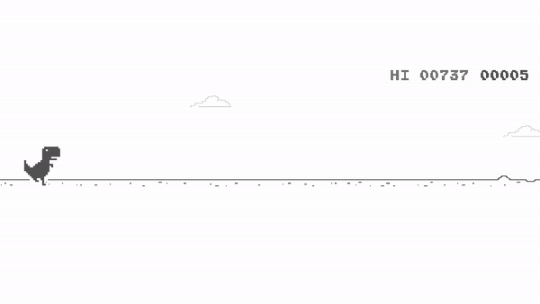
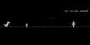

# DinoRL

<p align="center">
    
</p>

# Introduction
This is Dino. It is offline mode [T-Rex](https://github.com/hyunho1027/T-RexRL)

If you want to see the learning video, go [here](https://youtu.be/t9g9ILdjcmg)

## Agent
The agent is Dino

## Observation
This environment provides only visual observation

### Visual Observation


Shape: (64, 128, 2)  
(*dstack prev and current)

## Action
Jump(1) or Duck(0)

## Reward
-1 if terminal else 0.1

# Installation
```cmd
git clone https://github.com/hyunho1027/DinoRL
```

## Requirements
- Python 3.7
- Tensorflow 2.2
- pyautogui

## Usage
```cmd
python main.py
```


